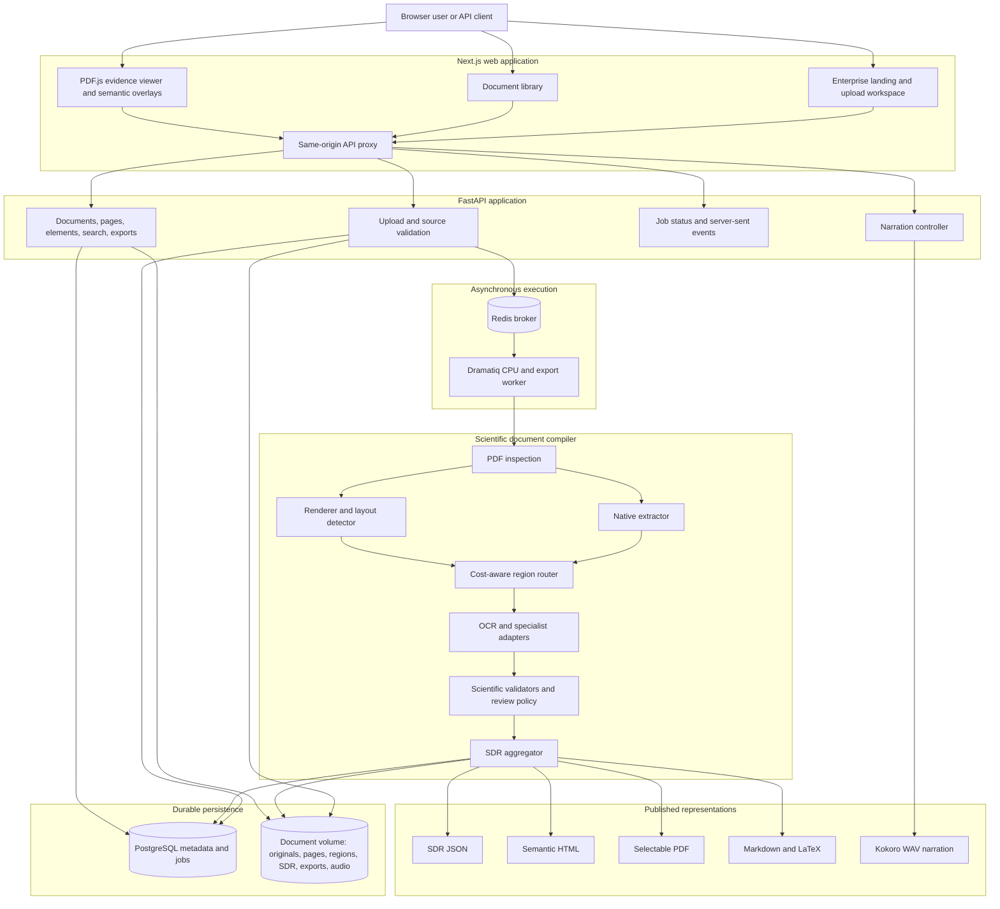
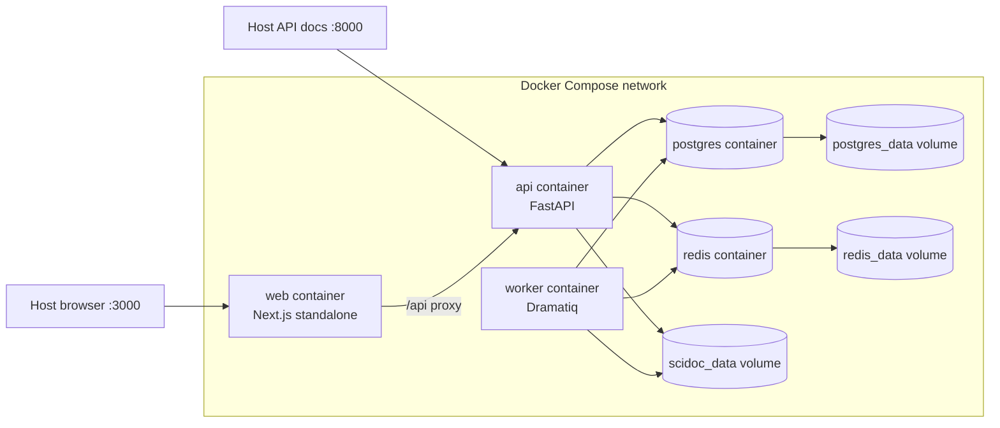
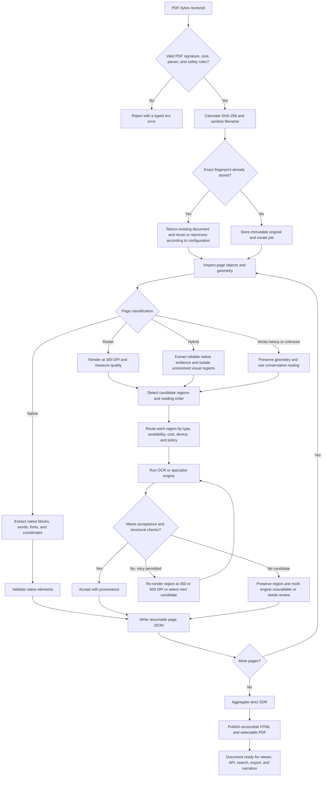
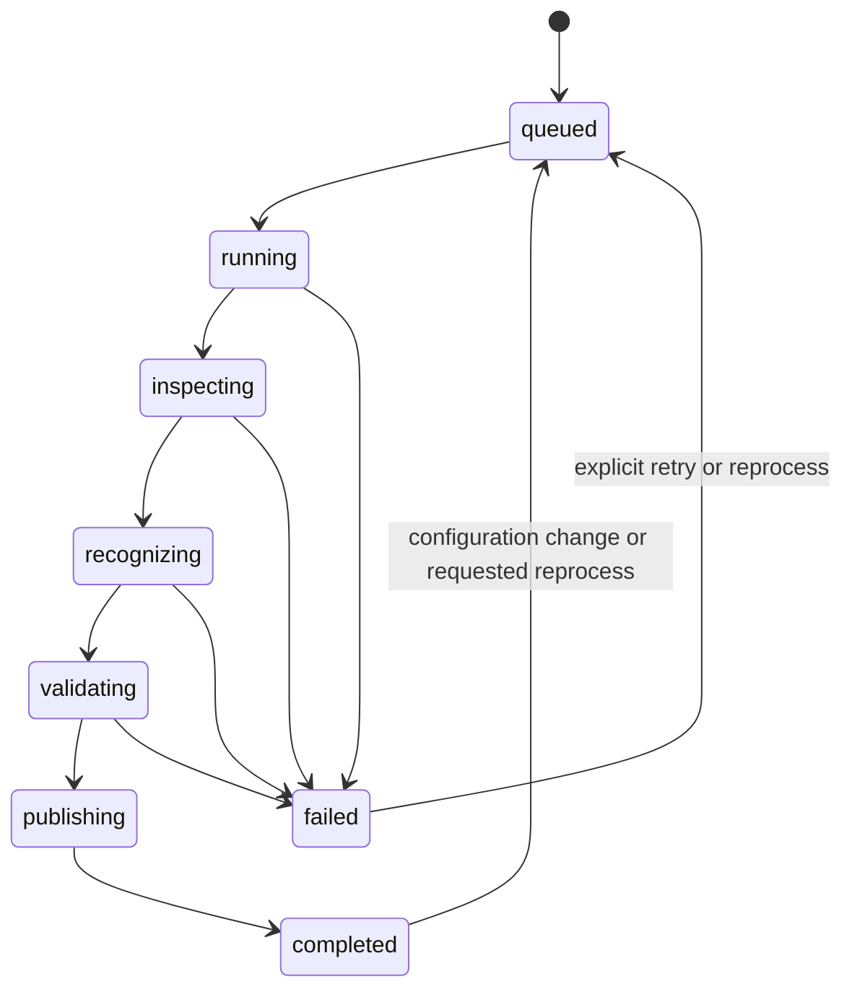
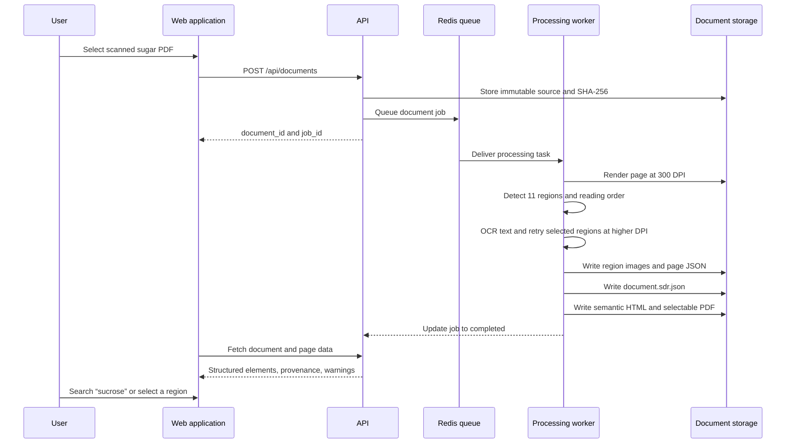
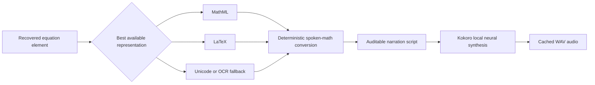

# NeetiTech Scientific Document Intelligence Platform

> A local-first scientific document compiler that transforms native, scanned, and hybrid PDFs into evidence-linked structured data, screen-reader-oriented HTML, selectable PDFs, searchable content, and natural local narration.

This repository contains a complete working foundation for scientific PDF ingestion, inspection, adaptive recognition, structured reconstruction, visual verification, accessibility export, search, and local neural narration. It is designed for documents in mathematics, physics, engineering, computer science, biology, medicine, chemistry, finance, quantitative research, and other disciplines where ordinary “extract all text” tools lose page geometry, equations, tables, diagrams, or provenance.

The platform does **not** treat OCR output as unquestionable truth. Every recovered element remains connected to its source page and bounding box and carries its recognition method, engine, confidence evidence, warnings, and review state. When a specialist engine is unavailable or a result is structurally suspicious, that limitation is recorded rather than hidden.

The supplied sample corpus comes from `source-documents.zip`. Conceptual references to `physics.pdf` are not used as the canonical sample input.

---

## Table of contents

1. [The project in one sentence](#the-project-in-one-sentence)
2. [The problem this platform is built to solve](#the-problem-this-platform-is-built-to-solve)
3. [What machine-readable means in this repository](#what-machine-readable-means-in-this-repository)
4. [What the platform currently delivers](#what-the-platform-currently-delivers)
5. [Five-minute Docker quick start for every supported desktop platform](#five-minute-docker-quick-start-for-every-supported-desktop-platform)
   1. [Windows with Docker Desktop and WSL 2](#windows-with-docker-desktop-and-wsl-2)
   2. [Linux with Docker Engine and Compose](#linux-with-docker-engine-and-compose)
   3. [macOS with Docker Desktop or Colima](#macos-with-docker-desktop-or-colima)
   4. [Opening the browser automatically](#opening-the-browser-automatically)
6. [How a person uses the application from upload to accessible output](#how-a-person-uses-the-application-from-upload-to-accessible-output)
7. [The complete system architecture](#the-complete-system-architecture)
8. [The complete PDF-to-SDR processing flow](#the-complete-pdf-to-sdr-processing-flow)
9. [Stage-by-stage processing details and evidence boundaries](#stage-by-stage-processing-details-and-evidence-boundaries)
   1. [Secure ingestion and immutable source preservation](#secure-ingestion-and-immutable-source-preservation)
   2. [Page inspection before recognition](#page-inspection-before-recognition)
   3. [Native, raster, hybrid, vector-heavy, and unknown classification](#native-raster-hybrid-vector-heavy-and-unknown-classification)
   4. [Native extraction without unnecessary OCR](#native-extraction-without-unnecessary-ocr)
   5. [Raster rendering, quality analysis, and layout detection](#raster-rendering-quality-analysis-and-layout-detection)
   6. [Per-region cost-aware engine routing](#per-region-cost-aware-engine-routing)
   7. [Text, formula, table, visual, chemistry, chart, diagram, and Braille handling](#text-formula-table-visual-chemistry-chart-diagram-and-braille-handling)
   8. [Validation, confidence, warnings, and human review](#validation-confidence-warnings-and-human-review)
   9. [Aggregation, publication, and resumability](#aggregation-publication-and-resumability)
10. [A complete end-to-end example using a truly pixel-based scanned page](#a-complete-end-to-end-example-using-a-truly-pixel-based-scanned-page)
11. [A complete end-to-end example using pixel-based mathematical equations](#a-complete-end-to-end-example-using-pixel-based-mathematical-equations)
12. [A comparison with a native-text PDF](#a-comparison-with-a-native-text-pdf)
13. [The Scientific Document Representation in detail](#the-scientific-document-representation-in-detail)
14. [Accessibility, screen readers, selectable PDFs, and natural narration](#accessibility-screen-readers-selectable-pdfs-and-natural-narration)
15. [Generated outputs and where every file is stored](#generated-outputs-and-where-every-file-is-stored)
16. [Using the web interface in detail](#using-the-web-interface-in-detail)
17. [Using the HTTP API with practical examples](#using-the-http-api-with-practical-examples)
18. [Using the command-line interface without Docker](#using-the-command-line-interface-without-docker)
19. [Docker deployment explained service by service](#docker-deployment-explained-service-by-service)
20. [Docker data persistence, backup, restore, updates, and removal](#docker-data-persistence-backup-restore-updates-and-removal)
21. [Sharing the application with another person on the same network](#sharing-the-application-with-another-person-on-the-same-network)
22. [Native development setup for contributors](#native-development-setup-for-contributors)
23. [Configuration reference](#configuration-reference)
24. [Recognition engines, AI, deep learning, LLM, VLM, and explicit non-use boundaries](#recognition-engines-ai-deep-learning-llm-vlm-and-explicit-non-use-boundaries)
25. [Security, privacy, and scientific-fidelity rules](#security-privacy-and-scientific-fidelity-rules)
26. [Observability, jobs, caching, retries, and failure behavior](#observability-jobs-caching-retries-and-failure-behavior)
27. [Testing, validation, and benchmarking](#testing-validation-and-benchmarking)
28. [Repository tree and responsibility map](#repository-tree-and-responsibility-map)
29. [Troubleshooting guide](#troubleshooting-guide)
30. [Current limitations and the difference between support and calibrated accuracy](#current-limitations-and-the-difference-between-support-and-calibrated-accuracy)
31. [Roadmap](#roadmap)
32. [Glossary](#glossary)
33. [License](#license)

### Recommended reading paths

This README is intentionally comprehensive. Use the path that matches what you
need to accomplish first, then return to the complete table of contents when
you need implementation or operational detail.

| Reader or goal | Recommended order |
| --- | --- |
| First-time user | [Docker quick start](#five-minute-docker-quick-start-for-every-supported-desktop-platform) → [web workflow](#how-a-person-uses-the-application-from-upload-to-accessible-output) → [outputs and storage](#generated-outputs-and-where-every-file-is-stored) |
| Screen-reader or narration user | [accessibility and narration](#accessibility-screen-readers-selectable-pdfs-and-natural-narration) → [web interface](#using-the-web-interface-in-detail) → [recognition limitations](#current-limitations-and-the-difference-between-support-and-calibrated-accuracy) |
| Scientific evaluator | [machine-readable definition](#what-machine-readable-means-in-this-repository) → [scanned-page example](#a-complete-end-to-end-example-using-a-truly-pixel-based-scanned-page) → [equation example](#a-complete-end-to-end-example-using-pixel-based-mathematical-equations) → [testing and benchmarking](#testing-validation-and-benchmarking) |
| Developer or architect | [architecture](#the-complete-system-architecture) → [processing flow](#the-complete-pdf-to-sdr-processing-flow) → [SDR schema](#the-scientific-document-representation-in-detail) → [AI decision ledger](#recognition-engines-ai-deep-learning-llm-vlm-and-explicit-non-use-boundaries) |
| Deployment operator | [Docker services](#docker-deployment-explained-service-by-service) → [persistence and backup](#docker-data-persistence-backup-restore-updates-and-removal) → [configuration](#configuration-reference) → [security](#security-privacy-and-scientific-fidelity-rules) → [troubleshooting](#troubleshooting-guide) |

---

## The project in one sentence

NeetiTech Scientific Document Intelligence is a local-first compiler that preserves an uploaded PDF as immutable visual evidence, extracts or recognizes its scientific content into a typed and versioned Scientific Document Representation (SDR), and publishes synchronized outputs for software, human inspection, copying, searching, screen readers, and natural speech.

The word **compiler** is intentional. The system does not merely return one long OCR string. It turns one source artifact into multiple explicit, related representations:

| Representation | Primary consumer | Purpose |
| --- | --- | --- |
| Original PDF | Human reviewer | Unmodified source and visual truth |
| Rendered page images | Recognition pipeline and reviewer | Stable pixel evidence at known DPI |
| Region crops | Recognition engines and reviewer | Exact local evidence used for a paragraph, equation, table, or visual |
| Page JSON | Resume logic and debugging | Incremental, page-level processing result |
| Canonical SDR JSON | Software and APIs | Typed elements, coordinates, reading order, content, confidence, provenance, and warnings |
| Semantic HTML | VoiceOver, NVDA, ChromeVox, and browser users | Headings, paragraphs, tables, MathML, navigation, review notes, and accessible labels |
| Selectable PDF | People who need the familiar visual page | A derivative copy with positioned text for selection and search |
| Markdown and LaTeX | Authors and downstream publishing tools | Portable editable representations |
| Narration WAV | Listening and accessibility workflows | Local neural speech for a page or selected semantic region |

---

## The problem this platform is built to solve

A PDF is a page-description format, not a guaranteed document-understanding format. Two PDFs may look identical in a browser while being radically different to software.

### A native PDF may already contain usable characters

In a well-formed native PDF, the sentence `The result is statistically significant` may exist as text spans with fonts and coordinates. A deterministic parser can recover those characters without optical recognition.

### A scanned PDF may contain only colored pixels

In a scanned PDF, the same sentence may be nothing more than image values:

```text
pixel (101, 238) = RGB(248, 248, 247)
pixel (102, 238) = RGB(31, 31, 29)
pixel (103, 238) = RGB(28, 28, 27)
...
```

The scan contains no explicit concept of a character, word, line, paragraph, chemical formula, equation, table cell, heading, caption, or reading order. A person sees language because the human visual system performs recognition. A computer needs an equivalent recognition and reconstruction process.

### Scientific pages are harder than ordinary prose

Ordinary OCR may recognize letters while still destroying meaning. Consider these transformations:

| Visual source | Damaged plain OCR | Meaning that can be lost |
| --- | --- | --- |
| `x² + y² = r²` | `x2 + y2 = r2` | Superscripts and exponent structure |
| `C₁₂H₂₂O₁₁` | `C12H22011` | Chemical subscripts; `O` versus zero |
| `∂Ψ/∂t` | `dY/dt` | Partial derivative and Greek symbol identity |
| A 4 × 6 data table | 24 words in reading order | Rows, columns, headers, and empty cells |
| A multi-column paper | Lines interleaved across columns | Human reading order |
| Braille dot cells | Decorative dots | Character and accessibility meaning |
| A circuit diagram | A single image | Component labels, connections, and topology |

The project therefore preserves both **content** and **evidence about content**.

---

## What machine-readable means in this repository

Machine-readable does not mean “the application produced a JSON file.” It means the output has a stable schema, typed fields, explicit coordinates, semantic element categories, parseable values, and enough evidence for another program to inspect how the result was produced.

A pixel-based equation can become an SDR element such as:

```json
{
  "id": "doc_example-p1-e7",
  "type": "equation",
  "bbox": [120.0, 430.0, 510.0, 505.0],
  "reading_order": 7,
  "content": {
    "text": "",
    "latex": "i\\hbar\\frac{\\partial\\Psi}{\\partial t}=\\hat H\\Psi",
    "mathml": "<math>...</math>",
    "unicode": "iℏ∂Ψ/∂t = ĤΨ",
    "candidates": []
  },
  "confidence": null,
  "confidence_source": "unavailable",
  "provenance": {
    "method": "formula_recognition",
    "engine": "formula_small",
    "model": "pix2tex",
    "source_page": 1
  },
  "review_status": "needs_review",
  "warnings": [
    "The formula engine does not provide calibrated confidence; review is required."
  ]
}
```

Important properties of this example are:

- The element is explicitly an `equation`, not an untyped text line.
- The rectangle connects the output to the location on page 1.
- Software can choose LaTeX, MathML, Unicode, or a spoken form.
- The engine and method are visible.
- `confidence: null` is retained rather than replaced with a fabricated number.
- The review state is a first-class field, not a note hidden in server logs.

### Machine-readable does not automatically mean correct

The following are separate questions:

1. **Is the output syntactically machine-readable?** Can a standards-compliant parser load it?
2. **Is the output semantically structured?** Does it distinguish equations, headings, tables, and figures?
3. **Is the recognition faithful?** Do the recovered symbols exactly match the source?
4. **Is the result accessible?** Can assistive software navigate and speak the reconstructed structure?

This repository addresses all four, but recognition fidelity remains dependent on source quality, installed engines, document domain, and empirical validation. The project never equates a valid JSON document with perfect scientific transcription.

---

## What the platform currently delivers

### Implemented and exercised capabilities

| Capability | Current behavior | Evidence or boundary |
| --- | --- | --- |
| PDF upload | Browser drag-and-drop and file picker | PDF MIME/signature/parser validation and configurable size limit |
| Source preservation | Original stored unchanged | SHA-256 fingerprint and isolated document directory |
| Duplicate detection | Exact same bytes resolve to existing document | SHA-256 based; near-duplicate pages are not deduplicated |
| Page inspection | Text, images, vectors, fonts, geometry, and rotation | PyMuPDF inspection before recognition |
| Native extraction | Direct text spans, words, fonts, bounding boxes, and order | OCR is skipped when native extraction meets policy |
| Raster processing | 300 DPI rendering with 450/600 DPI retry seams | Retry is region-aware and confidence-gated |
| OCR | RapidOCR or Tesseract in the default container | Local CPU processing; quality varies by scan |
| Formula routing | Dedicated formula regions and OCR fallback | Specialist pix2tex is optional and not in the default image |
| Table representation | Columns and rows in typed SDR content | Complex raster reconstruction requires benchmark validation |
| Visual preservation | Figures, diagrams, charts, and chemistry regions retain geometry | Full semantic interpretation needs configured specialist adapters |
| Braille | Unicode Braille preservation and deterministic Grade-1 transcription | Contractions and ambiguous visual cells remain review candidates |
| Review evidence | Confidence source, candidates, provenance, history, warnings | No invented score for engines that do not provide one |
| Search | Document substring search with conservative normalization | Not symbolic algebra search |
| Accessible HTML | Semantic headings, reading order, tables, equation labels/MathML, review notes | Primary assistive-technology output |
| Selectable PDF | New PDF with positioned text overlays | Selection/search artifact; not certified tagged PDF/UA |
| Natural narration | Kokoro-82M local neural voices | No account or API key; narration is downstream from the SDR |
| Interactive viewer | Original page plus semantic regions, inspector, copy, search, and narration | Click a region to inspect or read it |
| Background jobs | Redis and Dramatiq in Docker | Progress exposed through job endpoints and SSE |
| Persistence | PostgreSQL metadata plus durable document volume | Container restarts preserve data |

### Registered, enabled, installed, and calibrated are different states

The UI and API intentionally distinguish these terms:

| Term | Meaning |
| --- | --- |
| Registered | The software knows an adapter and its declared capabilities |
| Enabled | Routing policy is permitted to use that capability |
| Installed | The required package and model files are present at runtime |
| Available | The adapter has passed its runtime availability check |
| Calibrated | Its confidence and accuracy were measured on representative ground truth |

For example, chemistry and chart routing may be enabled while an OCSR or chart-digitization model is not installed. The platform still preserves the region, geometry, visible labels, and review requirement; it does not claim that the complete chemical graph or chart series was reconstructed.

---

## Five-minute Docker quick start for every supported desktop platform

Docker is the recommended route for someone who wants to use the application rather than develop its source code. The Docker deployment includes:

- The animated Next.js frontend.
- The FastAPI backend.
- PostgreSQL for durable metadata and job state.
- Redis for queued work.
- A Dramatiq processing worker.
- Tesseract and RapidOCR-compatible local OCR support.
- The Kokoro-82M local narration runtime and model files.

The host does **not** need Python, Node.js, PostgreSQL, Redis, Tesseract, or an OpenAI API key.

### Prerequisites for the Docker route

- Git.
- Docker Desktop on Windows/macOS, or Docker Engine plus the Compose plugin on Linux.
- Enough free disk space for Docker base images, Python/Node dependencies, OCR runtimes, and approximately 337 MB of Kokoro model assets. Several gigabytes of free Docker storage are recommended.
- An internet connection during the first build so Docker can retrieve base images, packages, and the local narration model. Runtime narration is local after the image is built.

### The same core commands on every platform

```bash
git clone https://github.com/nneupane1/Scientific-Document-Intelligence-Platform.git
cd Scientific-Document-Intelligence-Platform
docker compose up --build --detach
docker compose ps
```

When `api`, `worker`, and `web` are running and the health column reports healthy where applicable, open:

```text
http://localhost:3000
```

API documentation is available on the host at:

```text
http://localhost:8000/docs
```

The first build takes longer than later starts because it downloads container layers, Python packages, frontend packages, and the offline voice assets. Later starts normally use Docker’s build cache and persistent volumes.

Stop the application without deleting documents:

```bash
docker compose down
```

Start it again without rebuilding:

```bash
docker compose up --detach
```

Follow application and worker logs:

```bash
docker compose logs --follow api worker web
```

### Windows with Docker Desktop and WSL 2

1. Install Git for Windows.
2. Install Docker Desktop.
3. Enable the WSL 2 backend when Docker Desktop requests it.
4. Wait until Docker Desktop says the engine is running.
5. Open PowerShell in the directory where the repository should be stored.

```powershell
git clone https://github.com/nneupane1/Scientific-Document-Intelligence-Platform.git
Set-Location Scientific-Document-Intelligence-Platform
docker compose up --build --detach
docker compose ps
Start-Process "http://localhost:3000"
```

Use `curl.exe`, rather than PowerShell’s historical `curl` alias, for the API examples in this README.

To stop while preserving data:

```powershell
docker compose down
```

### Linux with Docker Engine and Compose

Install Docker Engine and the Docker Compose plugin using the packages appropriate for the distribution. Confirm both are available:

```bash
docker --version
docker compose version
```

Then run:

```bash
git clone https://github.com/nneupane1/Scientific-Document-Intelligence-Platform.git
cd Scientific-Document-Intelligence-Platform
docker compose up --build --detach
docker compose ps
xdg-open http://localhost:3000 >/dev/null 2>&1 &
```

If the current user cannot access the Docker socket, follow the Docker Engine post-installation guidance for the distribution or run the commands through the configured privilege mechanism. Avoid changing random repository permissions to solve a Docker daemon permission problem.

### macOS with Docker Desktop or Colima

Start Docker Desktop, or start the configured Colima runtime, and run:

```bash
git clone https://github.com/nneupane1/Scientific-Document-Intelligence-Platform.git
cd Scientific-Document-Intelligence-Platform
docker compose up --build --detach
docker compose ps
open http://localhost:3000
```

The native `make launch` workflow remains available for development, but Docker is the better portability test because it uses the same Linux containers as Windows Docker Desktop and a Linux host.

### Opening the browser automatically

Use the command for the host operating system after the containers are healthy:

| Host | Command |
| --- | --- |
| Windows PowerShell | `Start-Process "http://localhost:3000"` |
| Linux desktop | `xdg-open http://localhost:3000` |
| macOS | `open http://localhost:3000` |

Docker itself intentionally does not launch a host GUI application from inside a container. Browser opening belongs to the host shell.

---

## How a person uses the application from upload to accessible output

### Step 1: Open the document workspace

Open `http://localhost:3000`. The landing page explains the evidence-first processing policy, installed runtime capabilities, processing boundary, and document workflow. Scroll to **Start a transformation**, or use **Process a PDF** in the header.

### Step 2: Select a source PDF

Either:

- Drag a PDF into the upload area.
- Click **Browse PDF**.
- Click the primary document-processing call to action.

Only the selected PDF is uploaded. In the default Docker installation the browser sends it to the locally running Next.js service, which proxies API traffic to the locally running FastAPI service.

### Step 3: Start processing

Click **Upload and process**. The API returns a document ID and job ID immediately. The worker proceeds through inspection, extraction or recognition, validation, and publication.

The recent-document card shows:

- Filename.
- Page count.
- Short SHA-256 prefix.
- Document status.
- Current processing stage.
- Progress bar.
- Final links when processing completes.

### Step 4: Open the evidence viewer

Click **Inspect** or **Open viewer** on the completed document. The viewer shows the original page and positions semantic regions on top of it. It allows the user to:

- Move between pages.
- Select a paragraph, heading, equation, table, figure, or Braille region.
- Inspect recognized content.
- View confidence and warnings.
- See the engine and provenance.
- Copy a recovered representation.
- Listen to a page or selection.
- Open the selectable PDF.
- Open screen-reader HTML.
- Open the canonical SDR JSON.

### Step 5: Choose the output for the intended use

| User goal | Recommended output |
| --- | --- |
| Navigate and hear the reconstructed document with VoiceOver, NVDA, or ChromeVox | Screen-reader HTML |
| Keep the familiar visual page and select/copy recognized text | Selectable PDF |
| Integrate the result into software | SDR JSON or HTTP API |
| Review exactly where a value came from | Viewer plus region evidence and provenance |
| Listen with a natural local voice | Viewer narration controls |
| Edit or republish text | Markdown or LaTeX export, followed by human review |

### Step 6: Review warnings before relying on scientific values

Pay particular attention to:

- `needs_review` elements.
- Equations recognized through OCR fallback.
- Ambiguous superscripts, subscripts, decimal separators, or minus signs.
- Chemical formulas where `O`, `0`, `I`, `l`, or `1` may be confused.
- Empty regions.
- Tables with uncertain row or column boundaries.
- Figures preserved without a configured semantic specialist.

The source PDF remains visible so that a reviewer can compare the reconstruction with the original evidence.

---

## The complete system architecture



### Architectural responsibilities

| Layer | Technology | Responsibility |
| --- | --- | --- |
| Browser presentation | Next.js 16, React 19, PDF.js, KaTeX | Upload, animated product interface, library, source-page rendering, overlays, inspection, copying, exports, narration controls |
| HTTP boundary | FastAPI and Pydantic | Typed requests/responses, validation, downloads, search, job events, narration |
| Queue | Redis and Dramatiq | Durable work dispatch and separation of web request latency from document processing |
| Document pipeline | Python packages under `packages/` | Inspection, rendering, layout, routing, recognition, validation, aggregation, exports |
| Metadata database | PostgreSQL in Docker; SQLite for zero-infrastructure local development | Documents, pages, elements, jobs, processing runs, status, queryable metadata |
| Artifact storage | Local filesystem volume | Original PDFs, rendered images, crops, page results, SDR, exports, cached audio |
| Recognition adapters | PyMuPDF, OpenCV, RapidOCR/Tesseract, optional PaddleOCR/pix2tex/VLM | Evidence recovery through explicit capability boundaries |
| Narration | Kokoro ONNX by default | Natural local speech from deterministic narration scripts |

### Docker deployment topology



---

## The complete PDF-to-SDR processing flow

The principal invariant is:

> Never invoke a more expensive or more inferential stage when a cheaper stage has already produced evidence that meets the configured fidelity and confidence requirement.



### Region-level escalation instead of document-level escalation

A twenty-page scientific paper may contain nineteen pages of reliable native text and one scanned equation. The pipeline does not send all twenty pages through OCR or a vision model. It can retain native extraction for the reliable content and escalate only the unresolved equation region.

```text
Level 0  Existing native PDF evidence
   ↓ only when insufficient
Level 1  Deterministic geometry, image analysis, and direct reconstruction
   ↓ only when insufficient
Level 2  Lightweight local OCR or small specialist recognition
   ↓ only when enabled, available, and justified
Level 3  Stronger specialist engine
   ↓ only when explicitly configured
Level 4  Gated local vision-language model adapter
   ↓ when uncertainty remains
Level 5  Human review
```

This routing strategy limits cost, latency, unnecessary model exposure, and the risk of a generative system rewriting evidence that was already available deterministically.

---

## Stage-by-stage processing details and evidence boundaries

### Secure ingestion and immutable source preservation

The upload boundary treats every PDF as untrusted. The application:

1. Accepts `application/pdf` or guarded binary uploads.
2. Streams the upload into an isolated temporary file rather than trusting the original path.
3. Enforces `SCIDOC_MAX_UPLOAD_MB` while streaming.
4. Sanitizes the displayed filename.
5. Validates the PDF signature and parser behavior.
6. Rejects invalid or unsupported encrypted files.
7. Counts pages before creating a persistent record.
8. Computes SHA-256 over the exact uploaded bytes.
9. Uses a generated document ID for storage paths.
10. Copies the source to `documents/<id>/original/document.pdf`.

The filename is descriptive metadata. It is never used as an unrestricted filesystem path. The generated ID is constrained to safe characters, and the local storage backend rejects absolute paths and traversal outside the configured root.

### Page inspection before recognition

Before deciding which engine to use, PyMuPDF inspects:

- Page width and height.
- Rotation.
- Text blocks and characters.
- Native text coverage.
- Embedded images and image coverage.
- Vector objects and drawings.
- Fonts.
- Existing word and span coordinates.
- Whether the available text is substantial enough to trust as the primary route.

This avoids a common OCR-system mistake: flattening a high-quality native PDF into an image and then trying to rediscover characters that were already present exactly.

### Native, raster, hybrid, vector-heavy, and unknown classification

| Classification | Typical page | Preferred behavior |
| --- | --- | --- |
| `native` | Generated report with a usable text layer | Extract existing text and geometry directly |
| `raster` | Scanner output, photograph, fax, or image-only PDF | Render, analyze quality, detect regions, and recognize pixels |
| `hybrid` | Native prose plus image equations, screenshots, or scans | Preserve native evidence and process unresolved visual regions |
| `vector_heavy` | CAD-like, chart-heavy, or diagram-heavy page | Preserve vectors and use conservative visual routing |
| `unknown` | Evidence does not meet a known classification | Preserve what is known, use fallbacks, and expose uncertainty |

Classification is a routing decision, not a judgment about the scientific topic. A medical paper and quantitative-finance report can both be native, raster, or hybrid.

### Native extraction without unnecessary OCR

Reliable native blocks are converted into typed elements. The extractor retains:

- Text.
- Word boxes.
- Span boxes.
- Font family and size where available.
- Page coordinates.
- Reading order.
- Heading/paragraph heuristics.
- Native image regions.
- Provenance identifying PyMuPDF and the pipeline version.

Native content normally receives deterministic evidence confidence because the characters are read from the PDF’s content stream. This does **not** mean the scientific statement itself is true. If the author wrote `E = mc³`, native extraction preserves `E = mc³`; it does not “correct” it to `E = mc²`.

### Raster rendering, quality analysis, and layout detection

For image-based evidence, the renderer begins at the configured default DPI, normally 300. OpenCV-based measurements describe properties such as blur, contrast, and threshold behavior. The layout stage proposes regions and a reading order.

The system may retain:

- A complete rendered page image.
- Region-specific crops.
- Alternative higher-DPI crops for retry history.
- Detected region type.
- Original page-space bounding box.
- Pixel-space processing metadata.

Coordinates in the SDR are expressed in source page space so the same element can be drawn on the browser canvas regardless of display zoom.

### Per-region cost-aware engine routing

The router considers:

- Declared region type.
- Required capability such as OCR text or formula recognition.
- Adapter availability.
- Supported device: CPU, CUDA, or Apple MPS.
- Estimated cost.
- Configured acceptance threshold.
- Whether high-DPI retry is enabled.
- Whether larger specialist or VLM stages are enabled.
- Previous candidate results and history.

Each attempted candidate can be stored in `content.candidates`, while retry and escalation information remains in provenance history. This allows a reviewer or evaluator to see that the final value was not the first or only attempt.

### Text, formula, table, visual, chemistry, chart, diagram, and Braille handling

#### Text regions

Local OCR returns words, positions, text, and an engine-specific score when available. Text validators detect empty output and selected suspicious patterns. OCR confidence is not assumed to be directly comparable to native extraction or another model’s score.

#### Mathematical and scientific equations

Equation elements can contain:

- Raw OCR text.
- Raw LaTeX.
- Normalized LaTeX.
- MathML.
- Unicode.
- Alternative candidates.
- Spoken-math text derived for accessibility.

Ordinary OCR is a fallback, not the ideal formula recognizer. If the fallback loses superscripts, radicals, matrices, or delimiters, warnings and review state remain attached.

#### Tables

Table content is represented as explicit `columns` and `rows`, not only as a visual screenshot. Native tables and clear geometry can be reconstructed conservatively. The system does not use a language model to invent a missing value because the neighboring row “looks predictable.”

#### Figures, charts, diagrams, circuits, and chemistry

These are distinct SDR types. Even without a specialist semantic model, the platform can preserve the region, visible OCR labels, source page, bounding box, and review requirement. A future or separately configured specialist can add chemical graphs, chart series, or diagram relationships without changing the canonical evidence contract.

#### Braille

Unicode Braille is preserved. Grade-1 mappings can be handled deterministically. Contracted Braille, ambiguous dots, embossing artifacts, and visual Braille recognition should be reviewed by a qualified user; the application does not guess contractions as if they were certain.

### Validation, confidence, warnings, and human review

The confidence system communicates evidence state rather than presenting a decorative percentage.

| Field | Meaning |
| --- | --- |
| `confidence` | Engine score when a meaningful score exists; otherwise `null` |
| `confidence_source` | Where that number or absence came from |
| `review_status` | Accepted, uncertain, needs review, or engine unavailable |
| `warnings` | Human-readable structural or recognition concerns |
| `content.candidates` | Alternative or attempted engine outputs |
| `provenance` | Method, engine, model/version, device, source page, cache state, and history |

Typical warnings include:

- OCR returned no text.
- Equation OCR fallback was used.
- Superscripts, subscripts, or operators may require review.
- Parentheses appear unbalanced.
- A specialist engine is registered but unavailable.
- A visual region was preserved without specialist semantics.

### Aggregation, publication, and resumability

Each completed page is written to its own JSON file. On a later run, the pipeline can reuse a page result when its configuration hash still matches and the page was not explicitly forced for reprocessing.

After all pages are ready, the document pipeline:

1. Aggregates pages into a strict `SdrDocument`.
2. Calculates measured processing statistics.
3. Records the pipeline version, schema version, configuration hash, and available engine versions.
4. Stores the canonical SDR.
5. Publishes semantic HTML.
6. Publishes a selectable/searchable PDF derivative.
7. Marks the job and document complete.



---

## A complete end-to-end example using a truly pixel-based scanned page

The supplied `what-is-sugar-derived-scan.pdf` is a one-page raster document. A person sees a title, prose about sucrose, a chemical formula, and molecular visual content. The PDF does not provide reliable native text for those items.

### Before conversion

Conceptually, software has access to this:

```text
PDF page
└── one large raster image
    ├── black and grey pixels shaped like “What is sugar?”
    ├── pixels shaped like a paragraph
    ├── pixels shaped like C12H22O11
    └── pixels forming chemical/molecular visuals
```

It does not yet have this:

```text
heading: What is sugar?
paragraph: The white stuff we know as sugar is sucrose ...
chemical formula: C12H22O11
```

### Work performed by the current pipeline on this sample

| Measured item | Stored result from the sample run |
| --- | ---: |
| Pages | 1 |
| Page classification | Raster |
| Detected/processed regions | 11 |
| Native elements | 0 |
| OCR elements | 9 |
| Escalations | 7 |
| Higher-DPI retries | 3 |
| Engine-unavailable/failed regions | 2 |
| Elements requiring review | 9 |

An ASCII view of the processing counts makes the non-native workload visible:

```text
Native extraction     0
OCR regions           9  █████████
Formula regions       2  ██          specialist unavailable in that stored run
High-DPI retries      3  ███
Review candidates     9  █████████
```

These are routing and review counts, not accuracy percentages, and some categories overlap.

### A successfully searchable paragraph

One region was recovered as:

```text
The white stuff we know as sugar is sucrose, a molecule composed of 12 atoms of carbon, 22
```

The following region contained:

```text
atoms of hydrogen, and 11 atoms of oxygen
(C12H22O11)
```

After conversion, a search request for `sucrose` can return the page number, matching element, snippet, and bounding box. The original raster alone could not produce that structured search response.

### An example that demonstrates why review evidence matters

A title region was recognized as:

```text
W
hat
1S
sugar?
```

The intended visual text is evidently closer to:

```text
What is sugar?
```

The OCR engine nevertheless produced a high score. This is a concrete warning that engine confidence is not semantic truth. Recognition quality must be measured against manually verified ground truth, and validators still need improvement for high-confidence textual errors.

### The resulting data lineage



### After conversion

The output directory contains:

```text
original/document.pdf                   immutable raster source
rendered/page_0001_300dpi.png           rendered page evidence
regions/page_0001/region_..._300dpi.png recognition crops
regions/page_0001/region_..._450dpi.png retry evidence where needed
results/pages/page_0001.json            resumable page result
results/document.sdr.json               canonical machine-readable document
exports/document.html                   screen-reader-oriented document
exports/document.pdf                    selectable/searchable derivative
```

The generated PDF has extractable positioned text for the recovered content. The semantic HTML is still the recommended screen-reader representation because a text overlay alone is not equivalent to a tagged, structurally accessible PDF.

---

## A complete end-to-end example using pixel-based mathematical equations

The supplied `Formula.pdf` is a hybrid page. Its headings and explanatory prose are native PDF text, while two equations are embedded visual regions.

### What deterministic extraction recovers

The pipeline recovered native items including:

- `Mathpix API Demo`
- `How to meature distance between two points?`
- Explanatory prose.
- A permutation section.

The source spelling `meature` is preserved. Recognition is transcription, not editorial rewriting.

### What the visual equation appears to mean

The visual distance formula is expected to resemble:

```text
d = √((x₂ − x₁)² + (y₂ − y₁)²)
```

An ideal reviewed SDR representation could be:

```json
{
  "type": "equation",
  "content": {
    "latex": "d=\\sqrt{(x_2-x_1)^2+(y_2-y_1)^2}",
    "unicode": "d = √((x₂ − x₁)² + (y₂ − y₁)²)",
    "mathml": "<math>...</math>",
    "text": "d equals the square root of x two minus x one squared plus y two minus y one squared"
  },
  "review_status": "accepted"
}
```

### What the currently available OCR fallback actually recovered

Without the optional pix2tex specialist installed, the formula fallback produced content similar to:

```text
THE DISTANCE FORMULA
2
d=√l
x2-x)
y2 -yi)
```

It also generated an attempted LaTeX representation, but the element remained `needs_review` with warnings about:

- Formula OCR fallback.
- Superscripts and subscripts.
- Operators.
- Unbalanced parentheses.

This output is structurally machine-readable because it is typed, parseable, addressable, and evidence-linked. It is **not yet scientifically reliable enough to accept without review**. Installing a specialist formula engine and evaluating it on gold equations are required for production-grade mathematical transcription.

### How equation narration is constructed



The neural voice makes the deterministic script sound natural; it does not use a language model to repair the mathematics. If recognition produced the wrong equation, narration can faithfully speak the wrong recovered representation. The viewer therefore exposes the equation and warnings next to the audio control.

---

## A comparison with a native-text PDF

The supplied `What is sugar.pdf` demonstrates the inexpensive native path.

| Property | Native sugar PDF | Scanned sugar PDF | Formula PDF |
| --- | --- | --- | --- |
| Page classification | Native | Raster | Hybrid |
| Native elements | 3 | 0 | 7 |
| OCR required | No | Yes | Only for visual equations |
| High-DPI retry | No | Selected regions | Formula-dependent |
| Typical confidence source | Deterministic native PDF | OCR engine | Native PDF plus formula fallback |
| Review burden | Low | High in the stored sample | Concentrated on equations |
| Primary lesson | Do not OCR evidence already present | Pixels require recognition | Route unresolved regions, not the whole page |

The native PDF produced:

- A heading: `What is sugar?`
- A paragraph containing the sucrose description and `C12H22O11`.
- A native figure region.

No OCR or escalation was needed. This illustrates why the pipeline inspects before recognizing.

---

## The Scientific Document Representation in detail

The SDR is the canonical software contract. Export formats are derived views; the source PDF remains the visual evidence.

### Document-level structure

```json
{
  "schema_version": "0.1.0",
  "document": {
    "id": "doc_40f28cd55b3747df",
    "filename": "what-is-sugar-derived-scan.pdf",
    "sha256": "a05ae7056f...",
    "page_count": 1,
    "title": null,
    "created_at": "2026-08-18T...Z"
  },
  "pages": [],
  "processing": {
    "pages_processed": 1,
    "regions_processed": 11,
    "native_elements": 0,
    "ocr_elements": 9,
    "formula_elements": 0,
    "escalations": 7,
    "high_dpi_retries": 3,
    "cache_hits": 0,
    "cache_misses": 11,
    "failed_regions": 2,
    "human_review_elements": 9,
    "elapsed_seconds": 0.0
  },
  "pipeline_version": "0.2.0",
  "config_hash": "...",
  "model_versions": {}
}
```

Exact timing and model-version fields depend on the run. Stored older samples can retain an older pipeline version. That difference is intentional provenance and is a reason to reprocess after meaningful configuration or engine changes.

### Page-level structure

| Field | Type | Purpose |
| --- | --- | --- |
| `number` | Integer ≥ 1 | Source page number |
| `width`, `height` | Positive numbers | Source page-space dimensions |
| `classification` | Enum | Native, raster, hybrid, vector-heavy, or unknown |
| `elements` | Array | Ordered semantic objects |
| `metrics.rotation` | Integer | Page rotation |
| `metrics.text_blocks` | Integer | Native text evidence count |
| `metrics.text_coverage` | 0–1 | Relative page coverage |
| `metrics.embedded_images` | Integer | Image evidence count |
| `metrics.image_coverage` | 0–1 | Relative image coverage |
| `metrics.vector_objects` | Integer | Vector evidence count |
| `metrics.fonts` | Array | Fonts observed during inspection |
| `metrics.render_dpi` | Integer or null | Raster processing resolution |
| `metrics.quality` | Object | Measured image-quality signals |

### Supported element types

```text
paragraph       title             heading           equation
figure          caption           table             page_number
footnote        unknown           chemical_equation molecule
circuit         chart             diagram           braille
code            reference
```

### Element content fields

An element can carry only the representations relevant to its type:

| Field | Example use |
| --- | --- |
| `text` | Paragraph, heading, OCR fallback, code, caption |
| `latex` | Preferred equation representation |
| `raw_latex` | Unnormalized specialist output |
| `normalized_latex` | Conservatively normalized form |
| `mathml` | Browser and assistive-math representation |
| `unicode` | Plain Unicode scientific notation |
| `label` | Figure, table, or diagram label |
| `columns` | Table column names |
| `rows` | Table row/cell values |
| `alt_text` | Evidence-based visual description when available |
| `words` | Word-level geometry and scores |
| `spans` | Native span/font geometry |
| `candidates` | Recognition attempts and alternatives |

### Coordinate convention

Bounding boxes use:

```text
[x0, y0, x1, y1]
```

where the first pair is the upper-left boundary and the second pair is the lower-right boundary in source page coordinates. Validation rejects negative or reversed boxes.

```text
(0,0) ─────────────────────────► x
  │       ┌────────────────┐
  │       │ SDR element    │
  │       │ bbox           │
  │       └────────────────┘
  │
  ▼ y
```

### Schema implementations

The contract is represented in three forms:

- JSON Schema: `packages/schema/jsonschema/sdr.schema.json`
- Pydantic: `packages/schema/python/scidoc_schema/models.py`
- TypeScript: `packages/schema/typescript/sdr.ts`

The API validates with Pydantic, the backend stores strict JSON, and the frontend uses typed structures. `extra="forbid"` on the canonical models catches unexpected fields rather than silently accepting schema drift.

---

## Accessibility, screen readers, selectable PDFs, and natural narration

### Why semantic HTML is the primary screen-reader artifact

A screen reader needs structure, not merely pixels plus invisible text. The semantic HTML exporter can provide:

- Document landmarks.
- Page navigation.
- Heading hierarchy.
- Paragraph reading order.
- Lists where represented.
- Semantic table rows and cells.
- MathML or labeled mathematical fallbacks.
- Figures and captions.
- Braille transcription fields.
- Explicit review notices.
- Hidden provenance for inspection without cluttering the visual reading flow.

The quality of the accessible output is bounded by recognition and reconstruction quality. The exporter cannot produce a correct spoken equation from symbols the recognizer failed to recover.

### How to test with VoiceOver on macOS

1. Process a PDF.
2. Open **Screen reader HTML** from the document card or viewer rail.
3. Enable VoiceOver using the configured macOS shortcut, commonly `Command + F5`.
4. Navigate by headings, paragraphs, tables, and links.
5. Compare uncertain passages against the source PDF in the viewer.
6. Disable VoiceOver with the same configured shortcut when finished.

The repository also includes `make voiceover` and `make voiceover-math` helpers for the native macOS development workflow.

### How to test with NVDA on Windows

1. Install and start NVDA on the Windows host.
2. Open the generated **Screen reader HTML** in Chrome, Edge, or Firefox.
3. Use NVDA’s browser navigation commands to move by heading, paragraph, table, and form control.
4. Inspect any region announced with a review warning.
5. Use the selectable PDF for visual selection and copying, not as a substitute for semantic HTML.

### How to test with ChromeVox

Open the semantic HTML in Chrome or on ChromeOS, enable ChromeVox using the user’s configured accessibility shortcut, and navigate the document structure. Browser and operating-system shortcut mappings can vary, so refer to the device’s accessibility settings when the default shortcut has been changed.

### Selectable PDF behavior

The searchable-PDF exporter writes a new file and never modifies the source. It positions recovered text over the original visual page so that users can:

- Drag to select text.
- Copy recovered content.
- Search in many PDF viewers.
- Keep the original page appearance.

It is not yet guaranteed to be a tagged PDF/UA document. Text extraction can also differ between PDF applications. Use semantic HTML for structured assistive navigation.

### Natural local narration without an API key

The default Docker image contains Kokoro-82M v1.0 and four exposed voice choices:

- `af_heart` — default.
- `af_bella`.
- `af_nicole`.
- `bf_emma`.

Narration behavior:

1. A page or selected element is converted into a deterministic narration script.
2. Equations prefer MathML/LaTeX-aware spoken conversion.
3. Kokoro synthesizes the script locally through ONNX.
4. A content hash, voice, provider, model, and target identify the cache entry.
5. The WAV is stored under the document’s `exports/narration` directory.
6. Replaying unchanged content uses the cache.

The PDF, page image, coordinates, and text remain inside the local deployment when Kokoro is active. OpenAI narration remains an optional explicit override and is not required.

### Click-to-read behavior

In the viewer:

- Keep **Read on click** enabled.
- Click a semantic overlay on the PDF.
- The inspector changes to that element.
- The narration controller requests audio for that element.
- The browser plays the returned WAV.

Use **Listen to page** to narrate the reconstructed reading order for the complete page. Use **Listen to equation** or **Listen to selection** for a specific item.

---

## Generated outputs and where every file is stored

### Logical document tree

```text
data/
└── documents/
    └── <document-id>/
        ├── original/
        │   └── document.pdf
        ├── rendered/
        │   ├── page_0001_300dpi.png
        │   └── page_0001_450dpi.png              # only when retained/needed
        ├── regions/
        │   └── page_0001/
        │       ├── region_<element-id>_300dpi.png
        │       └── region_<element-id>_450dpi.png
        ├── results/
        │   ├── pages/
        │   │   └── page_0001.json
        │   └── document.sdr.json
        └── exports/
            ├── document.json
            ├── document.html
            ├── document.md
            ├── document.tex
            ├── document.pdf
            └── narration/
                └── <target>-<voice>-<content-hash>.wav
```

Not every optional export exists immediately. Processing automatically publishes the core SDR, accessible HTML, and selectable PDF. Other formats are created when the export endpoint or CLI requests them.

### Where Docker stores those files

Inside both the API and worker containers, the storage root is:

```text
/app/data
```

That path is backed by the named Docker volume:

```text
neetitech-document-intelligence_scidoc_data
```

The volume persists across `docker compose down` and container replacement. It is deleted only when the user explicitly removes volumes.

List generated artifacts:

```bash
docker compose exec api sh -lc "find /app/data/documents -maxdepth 5 -type f | sort"
```

Copy one SDR file to the current host directory:

```bash
docker compose cp api:/app/data/documents/<document-id>/results/document.sdr.json ./document.sdr.json
```

Copy the entire document storage tree to the host:

```bash
docker compose cp api:/app/data/documents ./scidoc-documents-backup
```

The normal user path is to download exports through the browser or API. Direct volume access is useful for backup, evaluation, and development.

### What PostgreSQL stores versus what the document volume stores

| PostgreSQL | Document volume |
| --- | --- |
| Document IDs, names, hashes, page count, status | Original PDF bytes |
| Page and element query records | Rendered page images |
| Jobs, stages, progress, errors, attempts | Region crops and retry evidence |
| Processing-run metadata | Page JSON and canonical SDR |
| Queryable confidence/provenance fields | HTML, PDF, JSON, Markdown, LaTeX exports |
| Timestamps and state | Narration WAV cache |

Redis carries queue and broker state; it is not the canonical document store.

---

## Using the web interface in detail

### Landing and capability explanation

The landing page is an enterprise-style product and technical overview. Its sections explain:

- Evidence-first document intelligence.
- The adaptive processing pipeline.
- Structured outputs.
- Visual inspection.
- Where deterministic code, OCR, optional deep learning, and explicitly bounded model use occur.
- Runtime engine availability.
- Trust boundaries and non-fabrication policy.

These sections are descriptive. Runtime availability is authoritative: an adapter labeled **on demand** is registered but its optional package/model is not currently installed.

### Upload workspace

The workspace accepts one PDF at a time. The upload button remains disabled until a file is selected. Processing begins only after the explicit user action.

### Recent-document library

The library is backed by the API and persistent database. Completed cards expose:

- **Selectable PDF** — open the visually familiar derivative with a text layer.
- **Screen reader HTML** — open the semantic accessibility representation.
- **Inspect** — open the source-linked viewer.

### Evidence viewer

The viewer combines:

- PDF.js canvas rendering of the original source.
- Semantic overlays positioned from SDR bounding boxes.
- An element inspector.
- KaTeX rendering for LaTeX when available.
- Confidence and warning display.
- Page navigation.
- Direct links to PDF, HTML, and SDR.
- Natural narration controls.

### Settings page

The settings view reports effective capabilities and processing policy. A visible feature flag does not imply that every optional specialist model is installed; consult adapter availability and reasons.

---

## Using the HTTP API with practical examples

The host API is available at `http://localhost:8000`. Interactive OpenAPI documentation is at `/docs`.

### Endpoint summary

| Method | Endpoint | Purpose |
| --- | --- | --- |
| `GET` | `/health` | Container/application health |
| `GET` | `/api/capabilities` | Effective features, policies, and engine states |
| `POST` | `/api/documents` | Upload and enqueue a PDF |
| `GET` | `/api/documents` | List documents |
| `GET` | `/api/documents/{id}` | Fetch document summary and latest job |
| `GET` | `/api/documents/{id}/file` | Download/open original source PDF |
| `GET` | `/api/documents/{id}/sdr` | Fetch canonical SDR |
| `POST` | `/api/documents/{id}/process` | Requeue document processing |
| `GET` | `/api/documents/{id}/pages` | List pages |
| `GET` | `/api/documents/{id}/pages/{number}` | Fetch page and elements |
| `GET` | `/api/documents/{id}/elements` | List/filter elements |
| `GET` | `/api/elements/{id}` | Fetch one element |
| `POST` | `/api/pages/{id}/reprocess` | Reprocess one page |
| `POST` | `/api/elements/{id}/reprocess` | Reprocess the owning page/element route |
| `GET` | `/api/jobs/{id}` | Poll job status |
| `GET` | `/api/jobs/{id}/events` | Server-sent progress events |
| `GET` | `/api/documents/{id}/search?q=...` | Search recovered text |
| `POST` | `/api/documents/{id}/export` | Create an export |
| `GET` | `/api/documents/{id}/exports/{extension}` | Download an existing/on-demand export |
| `GET` | `/api/narration/capabilities` | Active voice provider, model, voices, and privacy state |
| `POST` | `/api/documents/{id}/narration` | Generate or retrieve cached WAV narration |

### Upload a PDF from macOS or Linux

```bash
curl --fail-with-body \
  --form "file=@benchmark/datasets/source-documents/input/Formula.pdf" \
  http://localhost:8000/api/documents
```

Example response:

```json
{
  "document_id": "doc_f4f584d916da41ca",
  "job_id": "job_0123456789abcdef",
  "duplicate": false,
  "status": "queued"
}
```

### Upload a PDF from Windows PowerShell

```powershell
curl.exe --fail-with-body `
  --form "file=@C:\Users\YourName\Documents\Formula.pdf" `
  http://localhost:8000/api/documents
```

### Poll the job

```bash
curl http://localhost:8000/api/jobs/<job-id>
```

Important job fields include:

```json
{
  "status": "running",
  "progress": 0.5,
  "pages_completed": 1,
  "pages_total": 2,
  "stage": "processing page 2",
  "error": null,
  "attempts": 1
}
```

### Fetch and validate the canonical SDR

```bash
curl --fail \
  http://localhost:8000/api/documents/<document-id>/sdr \
  --output document.sdr.json
```

If `jq` is installed:

```bash
jq '.document, .processing, [.pages[].elements[] | {type, confidence, review_status}]' \
  document.sdr.json
```

Validate inside the API container without requiring host Python:

```bash
docker compose exec api python -c "from pathlib import Path; from scidoc_schema.models import SdrDocument; p=Path('/app/data/documents/<document-id>/results/document.sdr.json'); d=SdrDocument.model_validate_json(p.read_bytes()); print(d.document.id, len(d.pages), 'valid')"
```

### Search recovered content

```bash
curl --get \
  --data-urlencode "q=sucrose" \
  http://localhost:8000/api/documents/<document-id>/search
```

A search hit includes the source page, element, type, snippet, and bounding box so a client can navigate to the visual evidence.

### Request an accessible HTML export

```bash
curl --request POST \
  --header "Content-Type: application/json" \
  --data '{"format":"html"}' \
  http://localhost:8000/api/documents/<document-id>/export

curl --fail \
  http://localhost:8000/api/documents/<document-id>/exports/html \
  --output document.html
```

Valid export request formats are:

```text
json
html
markdown
latex
searchable_pdf
```

### Download the selectable PDF

The PDF is automatically refreshed from the current SDR when requested:

```bash
curl --fail \
  http://localhost:8000/api/documents/<document-id>/exports/pdf \
  --output selectable-document.pdf
```

### Generate local narration

Check the active provider:

```bash
curl http://localhost:8000/api/narration/capabilities
```

Narrate page 1:

```bash
curl --fail \
  --request POST \
  --header "Content-Type: application/json" \
  --data '{"page_number":1,"voice":"af_heart"}' \
  http://localhost:8000/api/documents/<document-id>/narration \
  --output page-1.wav
```

Narrate one equation or paragraph by element ID:

```bash
curl --fail \
  --request POST \
  --header "Content-Type: application/json" \
  --data '{"page_number":1,"element_id":"<element-id>","voice":"af_heart"}' \
  http://localhost:8000/api/documents/<document-id>/narration \
  --output selection.wav
```

Play the WAV using the host’s normal media player.

---

## Using the command-line interface without Docker

The CLI is useful for development, inspection, scripted processing, and evaluation. It requires the native Python environment described later.

Inspect a PDF without full recognition:

```bash
.venv/bin/scidoc inspect 'benchmark/datasets/source-documents/input/Formula.pdf'
```

Process locally:

```bash
.venv/bin/scidoc process 'benchmark/datasets/source-documents/input/Formula.pdf'
```

Export a processed document:

```bash
.venv/bin/scidoc export <document-id> --format json
.venv/bin/scidoc export <document-id> --format html
.venv/bin/scidoc export <document-id> --format searchable_pdf
```

Benchmark a directory:

```bash
.venv/bin/scidoc benchmark benchmark/datasets/source-documents/input
```

The CLI and API use the same core pipeline and schema packages.

---

## Docker deployment explained service by service

### Service inventory

| Service | Image/build | Exposed port | Durable volume | Health behavior |
| --- | --- | ---: | --- | --- |
| `web` | Local Next.js production image | `127.0.0.1:3000` by default | None | Fetches its own root page |
| `api` | Local Python image | `127.0.0.1:8000` by default | `scidoc_data` | Calls `/health` from inside container |
| `worker` | Same Python image | None | `scidoc_data` | Starts after API and Redis are healthy |
| `postgres` | `postgres:17-alpine` | Internal only | `postgres_data` | `pg_isready` |
| `redis` | `redis:7.4-alpine` | Internal only | `redis_data` | `redis-cli ping` |

### Why the web service proxies `/api`

Browser code normally uses relative `/api/...` paths. The Next.js server proxies those requests to `http://api:8000` inside the Compose network. Consequences include:

- The browser does not need to know Docker DNS names.
- LAN users need only the web port.
- CORS complexity is reduced.
- The backend can remain bound to loopback on the host while still serving the frontend internally.

### What is included in the API/worker image

- Python 3.12 slim runtime.
- Project Python packages installed from the repository.
- Tesseract OCR executable.
- RapidOCR-compatible Python dependencies.
- OpenCV headless runtime.
- Kokoro ONNX and sound-file dependencies.
- `espeak-ng` and required Linux audio/text-to-phoneme libraries.
- Kokoro model and voice-bank files stored in `/opt/scidoc/models/narration`.

The container runs as the non-root `scidoc` user with UID/GID 10001. Model files are immutable image content; generated artifacts go to the writable document volume.

### What is included in the web image

The production image uses a build stage and Next.js standalone output. It includes:

- The standalone Next.js server.
- Compiled static assets.
- The `public/` directory containing logo and AI visual assets.
- No development server or host `node_modules` mount.

### Build arguments and optional Python extras

The default image installs:

```text
SCIDOC_EXTRAS=ocr,voice
```

An experimental image with the optional formula package can be requested on macOS/Linux:

```bash
SCIDOC_EXTRAS=ocr,voice,math docker compose build --no-cache api
docker compose up --detach
```

Windows PowerShell equivalent:

```powershell
$env:SCIDOC_EXTRAS = "ocr,voice,math"
docker compose build --no-cache api
docker compose up --detach
```

This installs the adapter package but does not constitute a promise of cross-platform model availability, calibrated formula accuracy, or acceptable image size. Review the dependency/model license and test representative equations before production use.

### Useful Docker lifecycle commands

```bash
docker compose up --build --detach       # build and start everything
docker compose up --detach               # start using existing images
docker compose ps                        # show status and health
docker compose logs --follow             # follow all logs
docker compose logs --follow worker      # follow recognition work
docker compose restart api worker web    # restart application services
docker compose down                      # stop, preserve volumes
docker compose pull postgres redis       # update upstream infrastructure images
docker compose build --pull              # rebuild on current base images
```

Equivalent Make targets are available on systems with `make`:

```bash
make docker-up
make docker-status
make docker-logs
make docker-down
```

---

## Docker data persistence, backup, restore, updates, and removal

### Persistent volumes

```text
neetitech-document-intelligence_scidoc_data
neetitech-document-intelligence_postgres_data
neetitech-document-intelligence_redis_data
```

List them:

```bash
docker volume ls --filter name=neetitech-document-intelligence
```

### A normal stop does not delete user data

Safe:

```bash
docker compose down
```

Also safe for stored documents:

```bash
docker compose stop
docker compose start
```

### Back up document artifacts

With the stack running:

```bash
docker compose cp api:/app/data/documents ./scidoc-documents-backup
```

### Back up PostgreSQL metadata

Create the dump inside the container and copy it out:

```bash
docker compose exec postgres pg_dump -U scidoc -d scidoc -f /tmp/scidoc.sql
docker compose cp postgres:/tmp/scidoc.sql ./scidoc.sql
```

### Restore PostgreSQL metadata

Only restore into a compatible, intentionally selected deployment:

```bash
docker compose cp ./scidoc.sql postgres:/tmp/scidoc.sql
docker compose exec -T postgres psql -U scidoc -d scidoc -f /tmp/scidoc.sql
```

Document artifact storage and database metadata belong together. Back up both when preserving a deployment.

### Update after pulling repository changes

```bash
git pull
docker compose build --pull
docker compose up --detach
docker compose ps
```

Existing named volumes remain attached to the replacement containers.

### Completely delete the deployment and all local data

The following command is destructive and removes documents, generated outputs, database state, and Redis state:

```bash
docker compose down --volumes
```

Do not run it unless the data has been backed up or is intentionally disposable.

---

## Sharing the application with another person on the same network

The default Docker binding is loopback-only for safety. To share the frontend on a trusted LAN, bind only the web service to all host interfaces.

### macOS or Linux

```bash
SCIDOC_WEB_BIND=0.0.0.0 docker compose up --detach
```

### Windows PowerShell

```powershell
$env:SCIDOC_WEB_BIND = "0.0.0.0"
docker compose up --detach
```

Find the host’s LAN IP and share:

```text
http://<host-lan-ip>:3000
```

The frontend proxies API requests inside Docker, so the API port does not need to be exposed to the LAN.

Security warning: this V0 has no authentication, user separation, or authorization. Anyone who can reach the shared web address can upload PDFs and inspect locally stored documents. Use LAN exposure only on a trusted network, obey the host firewall, and return to loopback-only mode afterward:

```bash
docker compose down
docker compose up --detach
```

For the native macOS workflow, `make share` remains available and prints the detected LAN address.

---

## Native development setup for contributors

Docker is not required for the zero-infrastructure development mode, but native development requires:

- Python 3.12 or newer.
- Node.js 20 or newer.
- npm.
- `unzip` and `curl`.
- Optional system Tesseract.
- Docker only if using PostgreSQL/Redis instead of SQLite/background mode.

### One-time setup

```bash
cp .env.example .env
make setup
```

`make setup`:

1. Creates `.venv`.
2. Installs editable Python development, OCR, and voice extras.
3. Installs frontend dependencies.
4. Extracts the supplied sample corpus.
5. Downloads the local Kokoro model and voices.

### Launch and open automatically

```bash
make launch
```

The launcher starts the API and web service, waits for health, and opens the application. Stop it with `Ctrl+C` in the managing terminal or:

```bash
make stop
```

The launcher is idempotent: if a healthy managed instance is already running, it reports and opens that instance instead of failing with a confusing “port already in use” error.

### Native network sharing

```bash
make share
```

Override LAN detection when necessary:

```bash
SCIDOC_LAN_HOST=192.168.1.20 make share
```

### Infrastructure-backed development

```bash
make infra-up
make migrate
```

Then use separate terminals:

```bash
make workers
make api
make web
```

### Zero-infrastructure development

```bash
SCIDOC_DATABASE_URL=sqlite:///./data/scidoc.db \
SCIDOC_QUEUE_MODE=background \
make api
```

Then run `make web`. Use `SCIDOC_QUEUE_MODE=synchronous` for deterministic CLI and test scenarios.

---

## Configuration reference

Runtime settings use the `SCIDOC_` prefix. Pydantic loads `.env` in native mode. Compose provides container-safe values explicitly and accepts selected host substitutions.

### Core runtime configuration

| Variable | Default in code | Docker value | Purpose |
| --- | --- | --- | --- |
| `SCIDOC_ENVIRONMENT` | `local` | `container` | Logging/runtime label |
| `SCIDOC_DATABASE_URL` | SQLite path | Internal PostgreSQL URL | Metadata database |
| `SCIDOC_REDIS_URL` | Local Redis | Internal Redis URL | Queue broker |
| `SCIDOC_STORAGE_ROOT` | `./data` | `/app/data` | Artifact root |
| `SCIDOC_QUEUE_MODE` | `background` | `dramatiq` | Background, Dramatiq, or synchronous execution |
| `SCIDOC_MAX_UPLOAD_MB` | `250` | `250` | Upload size limit |
| `SCIDOC_LOG_LEVEL` | `INFO` | `INFO` | Application log threshold |
| `SCIDOC_CORS_ORIGINS` | Localhost origins | Localhost origins | Direct cross-origin API allowlist |

### Processing and routing configuration

| Variable | Default | Meaning |
| --- | ---: | --- |
| `SCIDOC_DEFAULT_DPI` | 300 | Initial raster render resolution |
| `SCIDOC_ESCALATION_DPI` | 450 | First higher-resolution retry |
| `SCIDOC_MAX_DPI` | 600 | Maximum configured retry resolution |
| `SCIDOC_NATIVE_ACCEPTANCE` | 0.99 | Native route acceptance policy |
| `SCIDOC_OCR_ACCEPTANCE` | 0.97 | OCR route threshold |
| `SCIDOC_FORMULA_ACCEPTANCE` | 0.97 | Formula route threshold |
| `SCIDOC_NATIVE_MIN_CHARACTERS` | 8 | Minimum evidence for native-text consideration |
| `SCIDOC_ENABLE_HIGH_DPI_RETRY` | true | Permit higher-DPI regional retry |
| `SCIDOC_ENABLE_LARGE_FORMULA_ENGINE` | false | Permit registered large formula route |

### Domain feature flags

| Variable | Default | Important interpretation |
| --- | ---: | --- |
| `SCIDOC_ENABLE_TABLES` | true | Table routing is permitted; complex accuracy still depends on evidence/engine |
| `SCIDOC_ENABLE_CHEMISTRY` | true | Chemistry regions are typed/preserved; full OCSR requires a configured specialist |
| `SCIDOC_ENABLE_DIAGRAMS` | true | Diagram routing is permitted; relationship extraction is not automatically complete |
| `SCIDOC_ENABLE_CHARTS` | true | Chart regions are preserved; full numerical digitization needs specialist validation |
| `SCIDOC_ENABLE_VLM` | true | Policy may permit a VLM adapter; no adapter is configured in the default deployment |

### Narration configuration

| Variable | Default | Purpose |
| --- | --- | --- |
| `SCIDOC_NARRATION_PROVIDER` | `auto` in code; `kokoro` in Docker | Select `auto`, `kokoro`, `macos`, or `openai` |
| `SCIDOC_NARRATION_LOCAL_MODEL` | Local data path | Kokoro ONNX model file |
| `SCIDOC_NARRATION_LOCAL_VOICES` | Local data path | Kokoro voice bank |
| `SCIDOC_NARRATION_LOCAL_DEFAULT_VOICE` | `af_heart` | Default local neural voice |
| `SCIDOC_NARRATION_LOCAL_SPEED` | `0.95` | Speech-rate multiplier |
| `OPENAI_API_KEY` | Empty | Optional OpenAI narration only |
| `SCIDOC_NARRATION_API_KEY` | Empty | Alternative server-side narration key variable |

Never expose a provider key through a `NEXT_PUBLIC_*` environment variable. Browser-visible variables are not secrets.

### Docker host variables

| Variable | Default | Purpose |
| --- | --- | --- |
| `SCIDOC_WEB_BIND` | `127.0.0.1` | Host interface for frontend |
| `SCIDOC_WEB_PORT` | `3000` | Host frontend port |
| `SCIDOC_API_BIND` | `127.0.0.1` | Host interface for direct API access |
| `SCIDOC_API_PORT` | `8000` | Host API port |
| `SCIDOC_EXTRAS` | `ocr,voice` | Python optional extras at image build time |

---

## Recognition engines, AI, deep learning, LLM, VLM, and explicit non-use boundaries

The phrase “AI document intelligence” can obscure which component actually made a decision. This project makes those boundaries explicit.

### Decision ledger

| Document signal | Route | Method class | Hard boundary |
| --- | --- | --- | --- |
| Native PDF text | PyMuPDF text spans and page geometry | Deterministic | No OCR, LLM, or VLM when native evidence is accepted |
| Page/image geometry | PyMuPDF and OpenCV | Deterministic/classical CV | Geometry is not invented by a generative model |
| Scanned text | RapidOCR or Tesseract; optional PaddleOCR | OCR, potentially local deep learning | Word boxes and confidence evidence retained |
| Mathematical equations | Native notation, optional pix2tex, OCR fallback | Rules plus optional specialist DL | Uncertain structure requires review |
| Tables | Cell geometry, rows/columns, OCR when needed | Geometry first | No generative row completion |
| Charts, diagrams, chemistry | Vector/CV preservation, OCR-visible labels, optional specialist/VLM escalation | Evidence-gated | Model output must not silently replace source evidence |
| Unicode Braille | Unicode mapping and dot geometry | Deterministic | Unknown/contracted cells preserved and reviewed |
| Natural speech | Deterministic narration script plus Kokoro synthesis | Local neural TTS | Voice changes delivery, not SDR content |

### Where no language model is used

The default core evidence path does not use an LLM to:

- Rewrite native text.
- Correct the author’s spelling.
- Complete a sentence hidden by a scan artifact.
- Guess a table cell from neighboring rows.
- Repair an equation without recording a separate candidate.
- Describe a figure as established fact when no evidence-based description exists.
- Generate confidence values.
- Change the canonical SDR during narration.

### Where deep learning may be used

- RapidOCR may use local ONNX recognition models.
- PaddleOCR is an optional deeper OCR adapter.
- pix2tex is an optional local neural formula adapter.
- A compatible local vision-language adapter can be added behind routing and evidence gates.
- Kokoro is a local neural text-to-speech model.

### Why the default Docker image does not include every possible model

Specialist models can add gigabytes, architecture constraints, incompatible dependency stacks, GPU requirements, licensing obligations, and domain-specific failure modes. A single universal image would be slower to build and harder to audit. The base deployment therefore includes useful local OCR and narration while exposing optional specialist seams honestly.

### Model availability endpoint

Inspect actual runtime state:

```bash
curl http://localhost:8000/api/capabilities
```

An engine result can report:

- Name and version.
- Declared capabilities.
- Supported devices.
- Availability boolean.
- Reason for unavailability.

Trust runtime state over marketing copy.

---

## Security, privacy, and scientific-fidelity rules

### Source and filesystem security

- Uploaded names are sanitized.
- Generated document IDs determine storage paths.
- Absolute storage keys are rejected.
- Traversal outside the configured root is rejected.
- Embedded PDF scripts are not executed by the backend.
- Original PDFs are never modified.
- Exported HTML escapes recovered content.
- File size and parser validation occur before processing.

### Data locality

In the default Docker deployment:

- PDFs remain in the local Docker volume.
- OCR runs locally.
- Database and Redis run locally.
- Kokoro narration runs locally.
- The application does not require a cloud account or API key.

The initial Docker build uses the internet to download software and model assets. Processing after build is local unless the operator explicitly configures a remote provider or future remote adapter.

### Scientific fidelity

Recognition is transcription, not scientific correction. Validators may attach warnings, but they do not silently change evidence. Downstream summarization or semantic enrichment should be represented as a separate, labeled, source-cited layer rather than mixed into the canonical transcription.

### Deployment security boundary

This V0 does not provide:

- Authentication.
- Authorization.
- Per-user document isolation.
- Tenant isolation.
- Rate limiting suitable for internet exposure.
- Malware sandboxing for a public upload service.
- Subscription or billing enforcement.

Do not expose this deployment directly to the public internet. Add an authenticated gateway, TLS, tenant isolation, resource limits, monitoring, backups, and a PDF sandbox before operating it as a public SaaS product.

---

## Observability, jobs, caching, retries, and failure behavior

### Job lifecycle information

Jobs expose:

- Job ID and document ID.
- Type.
- Status.
- Attempt count.
- Progress from 0 to 1.
- Completed and total pages.
- Current stage.
- Error text.
- Created, started, and completed timestamps.

The frontend subscribes to server-sent events for progress and can also poll the job endpoint.

### Processing run provenance

Each run stores or emits:

- Pipeline version.
- SDR schema version.
- Configuration hash.
- Git commit when available.
- Available engine versions.
- Start/completion time.
- Measured counts and elapsed time.

### Resumability

Completed page JSON can be reused when:

- The page record is complete.
- The stored configuration hash matches.
- The result file still exists.
- The page was not explicitly forced for reprocessing.

### Caching

- Recognition provenance records cache hit/miss state where applicable.
- Page result files support pipeline resume.
- Narration audio is content-addressed by provider, model, voice, target, script, and cache version.

### Retry philosophy

Retries are bounded and visible. A region can be re-rendered at higher DPI or sent to another available candidate. A failed specialist route does not justify fabricating a value; it leads to a fallback, warning, `engine_unavailable`, or human-review state.

---

## Testing, validation, and benchmarking

### Native test suite

```bash
make test
make lint
npm run build
```

Equivalent individual checks:

```bash
.venv/bin/pytest
.venv/bin/ruff check .
.venv/bin/ruff format --check .
.venv/bin/mypy apps/api/src packages cli/src
npm run lint
npm run typecheck
npm test
npm run build
```

### What the tests cover

- Bounding-box validation.
- Confidence and routing behavior.
- PDF classification.
- Text metrics.
- SDR schema behavior.
- Storage traversal protection.
- Accessible HTML export.
- Searchable PDF text overlay.
- Math conversion and validation.
- Braille behavior.
- Narration script generation.
- API upload, processing, retrieval, and export paths.
- Supplied-corpus regression expectations.
- Frontend API and coordinate behavior.
- Playwright viewer workflow foundations.

### Docker validation commands

```bash
docker compose config --quiet
docker compose build
docker compose up --detach
docker compose ps
curl --fail http://localhost:8000/health
curl --fail http://localhost:3000/
curl --fail http://localhost:8000/api/capabilities
```

A meaningful smoke test should also upload a real PDF, wait for completion, validate the SDR with the Pydantic schema, open the HTML/PDF exports, and request a narration WAV.

### Benchmarking without invented accuracy

```bash
make benchmark
```

The benchmark framework can report measured routing, timing, escalation, and resource-related statistics. CER, WER, equation accuracy, and layout accuracy require manually verified ground truth. The software must not manufacture an “accuracy score” by comparing its output to itself.

### Recommended evaluation experiment

1. Choose representative real documents for each target domain.
2. Select difficult pages rather than only clean pages.
3. Create verified text, equation, table, and layout ground truth.
4. Record source quality and page classification.
5. Measure character error rate, word error rate, equation exact/structure match, table structure, reading order, review recall, time, RAM, and GPU use.
6. Compare routes and thresholds.
7. Inspect high-confidence errors separately.
8. Publish model version and configuration with the report.

---

## Repository tree and responsibility map

The following tree is intentionally descriptive rather than a dump of generated caches:

```text
machine-readable-document/
├── apps/
│   ├── api/
│   │   ├── Dockerfile                         Python OCR/narration runtime image
│   │   └── src/scidoc_api/
│   │       ├── main.py                        FastAPI assembly and health endpoint
│   │       ├── schemas.py                     HTTP request/response contracts
│   │       ├── services.py                    Background/queue dispatch boundary
│   │       ├── neural_voice.py                Kokoro/macOS/OpenAI provider adapters
│   │       ├── middleware/                    Request ID behavior
│   │       ├── dependencies/                  Settings and database dependencies
│   │       └── routes/
│   │           ├── capabilities.py            Runtime capability ledger
│   │           ├── documents.py               Upload, list, source, SDR, processing
│   │           ├── pages.py                   Page retrieval and reprocess
│   │           ├── elements.py                Element retrieval and reprocess
│   │           ├── jobs.py                    Job polling and SSE
│   │           ├── search.py                  Document search
│   │           ├── exports.py                 Export creation/download
│   │           └── narration.py               Page/element WAV narration
│   └── web/
│       ├── Dockerfile                         Next.js standalone production image
│       ├── next.config.ts                     API proxy and build behavior
│       ├── public/ai-assets/                  Transparent AI illustrations
│       └── src/
│           ├── app/                           Landing, documents, settings, viewer routes
│           ├── components/
│           │   ├── Upload/                    Landing, upload, library, runtime sections
│           │   ├── Viewer/                    Evidence viewer composition
│           │   ├── PdfCanvas/                 PDF.js source rendering
│           │   ├── SemanticOverlay/           Typed interactive regions
│           │   ├── ElementInspector/          Content/confidence/provenance review
│           │   ├── NaturalNarration/          Click/read/page audio controls
│           │   └── JobProgress/               SSE progress behavior
│           ├── lib/                           API client and coordinate helpers
│           └── types/                         Frontend SDR types
├── packages/
│   ├── core/                                  Settings, document safety, geometry, confidence
│   ├── database/                              SQLAlchemy models, repositories, sessions
│   ├── engines/                               OCR, formula, table, chemistry, diagram, VLM seams
│   ├── evaluation/                            CER/WER/equation/layout/report utilities
│   ├── exporters/                             JSON, HTML, Markdown, LaTeX, PDF, narration script
│   ├── jobs/                                  Redis broker, Dramatiq actors, progress/retry seams
│   ├── layout/                                Region and reading-order detection
│   ├── observability/                         Logging, timing, tracing, metrics
│   ├── pdf/                                   Inspection, extraction, rendering, security
│   ├── pipeline/                              Page/document orchestration
│   ├── preprocessing/                         Image quality and transformations
│   ├── routing/                               Policy, cost, escalation, resource selection
│   ├── schema/                                JSON Schema, Pydantic, TypeScript contracts
│   ├── search/                                Text and conservative math normalization
│   ├── storage/                               Safe local artifact storage and path rules
│   └── validation/                            Text, math, scientific-symbol, consensus, review
├── cli/src/scidoc_cli/                        Inspect/process/export/benchmark commands
├── workers/                                   CPU, OCR, GPU, and export entrypoint seams
├── config/                                    Human-readable default/model/routing policies
├── migrations/                                Alembic database migration
├── benchmark/
│   ├── datasets/source-documents/input/       Extracted supplied sample corpus
│   ├── ground_truth/                          Evaluation references
│   └── reports/                               Generated benchmark reports
├── docs/
│   ├── adr/                                   Architectural decision records
│   ├── architecture/                          Detailed subsystem documents
│   └── diagrams/                              Mermaid sources
├── scripts/                                   Setup, launch, model, benchmark, and test helpers
├── tests/
│   ├── unit/                                  Component behavior
│   ├── integration/                           Pipeline/API behavior
│   ├── regression/                            Supplied corpus expectations
│   └── e2e/                                   Browser workflow
├── data/                                      Native-run artifacts and models; ignored by Git
├── .dockerignore                              Small and safe build context
├── .env.example                               Native environment template
├── docker-compose.yml                         Portable five-service deployment
├── Makefile                                   Native and Docker convenience commands
├── pyproject.toml                             Python package and tool configuration
├── package.json                               Frontend workspace commands
├── source-documents.zip                       Canonical supplied sample archive
└── README.md                                  This operator and architecture manual
```

### Related architectural documents

- [Architecture overview](docs/architecture/overview.md)
- [Processing pipeline](docs/architecture/pipeline.md)
- [Routing policy](docs/architecture/routing.md)
- [SDR schema](docs/architecture/sdr-schema.md)
- [Storage and resume model](docs/architecture/storage.md)
- [Evaluation methodology](docs/architecture/evaluation.md)
- [Benchmark guide](benchmark/README.md)
- [Local-first ADR](docs/adr/0001-local-first.md)
- [Canonical SDR ADR](docs/adr/0002-sdr-canonical-format.md)
- [Cost-aware routing ADR](docs/adr/0003-cost-aware-routing.md)
- [Engine abstraction ADR](docs/adr/0004-engine-abstraction.md)

---

## Troubleshooting guide

### Docker command exists but the daemon is not running

Symptom:

```text
Cannot connect to the Docker daemon
```

Resolution:

- Start Docker Desktop on Windows/macOS.
- Start the Docker service on Linux.
- Start Colima if that is the selected macOS Docker context.
- Confirm with `docker info` before rebuilding the application.

### Port 3000 or 8000 is already in use

Use different host ports without changing container networking.

macOS/Linux:

```bash
SCIDOC_WEB_PORT=3100 SCIDOC_API_PORT=8100 docker compose up --detach
```

Windows PowerShell:

```powershell
$env:SCIDOC_WEB_PORT = "3100"
$env:SCIDOC_API_PORT = "8100"
docker compose up --detach
```

Then open `http://localhost:3100` and API docs at `http://localhost:8100/docs`.

### A service is unhealthy or repeatedly restarting

```bash
docker compose ps
docker compose logs --tail=200 api
docker compose logs --tail=200 worker
docker compose logs --tail=200 web
docker compose logs --tail=200 postgres redis
```

Read the first causal error rather than only the final restart message.

### The first Docker build is slow

The image downloads Python dependencies, OCR runtime components, frontend packages, and approximately 337 MB of local voice assets. Confirm network connectivity and free Docker disk space. Do not cancel a healthy model download merely because it takes longer than a normal code-only image build.

### The browser loads but document calls fail

Check:

```bash
curl --fail http://localhost:8000/health
curl --fail http://localhost:8000/api/capabilities
docker compose logs --tail=200 web api
```

The web server proxies `/api` to the Compose service named `api`. Rebuilding only one service after changing proxy configuration can leave an old frontend image running; rebuild `web`.

### Upload remains queued

Check worker and Redis:

```bash
docker compose ps worker redis
docker compose logs --tail=300 worker redis
```

The Docker API uses `SCIDOC_QUEUE_MODE=dramatiq`, so a healthy worker must consume the `cpu` queue.

### A formula is recognized badly

This is expected when the source is pixel-based and only ordinary OCR fallback is available. Inspect:

- Region crop.
- DPI and retry history.
- Candidate outputs.
- Warnings.
- Availability of `formula_small` in `/api/capabilities`.

Consider building the optional math extra, but validate it against representative ground truth. Never remove `needs_review` merely because a specialist model returned fluent-looking LaTeX.

### Narration is unavailable

```bash
curl http://localhost:8000/api/narration/capabilities
docker compose logs --tail=200 api
docker compose exec api ls -lh /opt/scidoc/models/narration
```

The default Docker provider is `kokoro`. Both the ONNX model and voice bank must exist. The browser may also require a user click before audio playback because of normal autoplay policy.

### Narration sounds natural but reads an equation incorrectly

Voice synthesis and equation recognition are separate. Kokoro can clearly speak an incorrect recovered script. Review the equation element’s LaTeX/MathML/Unicode, source crop, and warnings. Improve recognition before treating speech quality as evidence of mathematical correctness.

### A selectable PDF still does not read well in a screen reader

Use the semantic HTML export. A positioned text overlay supports selection and search but does not automatically create tags, landmarks, table headers, MathML navigation, or a certified PDF/UA structure.

### Files seem to disappear after rebuilding

Check that Compose is using the expected project and volumes:

```bash
docker compose ls
docker volume ls --filter name=neetitech-document-intelligence
docker compose config | sed -n '/volumes:/,$p'
```

`docker compose down` preserves named volumes. `docker compose down --volumes` deletes them.

### The application is reachable locally but not from another computer

Confirm:

- `SCIDOC_WEB_BIND=0.0.0.0` was set when the web container was created.
- The host firewall permits inbound TCP 3000 on the trusted network.
- Both devices are on the same routable LAN.
- The visitor uses the host’s LAN IP, not `localhost`.
- Guest Wi-Fi/client isolation is not blocking peer access.

### Windows path or shell examples behave differently

- Use PowerShell examples when running PowerShell.
- Use `curl.exe` explicitly.
- Use `Set-Location` or quote paths containing spaces.
- Run Compose from the repository root containing `docker-compose.yml`.
- Do not translate container paths such as `/app/data` into Windows paths; those paths exist inside Linux containers.

### Docker disk usage is unexpectedly high

Inspect:

```bash
docker system df
docker image ls
docker volume ls
```

The OCR/voice image is intentionally larger than a basic web API image. Remove only images and volumes you have identified. A broad prune can delete unrelated caches or stopped-project data.

---

## Current limitations and the difference between support and calibrated accuracy

The current repository is a substantial working V0/V1 foundation, not a claim of perfect universal scientific-document understanding.

### Recognition limitations

- Classical raster layout detection is deliberately modest for difficult multi-column pages.
- OCR quality depends on resolution, blur, contrast, language, typography, and diagrams intersecting text.
- High OCR confidence can still be wrong.
- Native equation-to-LaTeX reconstruction is conservative.
- The default Docker image does not include pix2tex.
- pix2tex does not expose a calibrated score through its common API, so its results must remain review candidates.
- Complex tables need domain-specific evaluation.
- OCSR, complete reaction parsing, numerical chart digitization, and diagram relationship graphs are not production-configured specialists.
- Braille contractions and difficult embossed scans require expert validation.

### Accessibility limitations

- Semantic HTML is the primary assistive artifact and is bounded by recovered structure and reading order.
- The selectable PDF is not certified PDF/UA.
- Figure descriptions are only as reliable as the available evidence/adapter.
- Natural narration reads the reconstructed content; it does not independently verify it.

### Search limitations

- Search is substring-oriented with conservative normalization.
- It is not a computer algebra system.
- Equivalent symbolic expressions are not guaranteed to match.
- Cross-reference and citation graphs remain future work.

### Processing and scaling limitations

- The V0 orchestrator processes pages sequentially inside a document for predictable local resource usage.
- Queue seams exist for larger deployments, but autoscaling and distributed artifact storage are not configured.
- GPU passthrough is not included in the default portable Compose file.
- Very large PDFs need explicit resource and workload testing.

### Productization limitations

- No login or user management.
- No multi-tenancy.
- No subscription or billing layer.
- No public-cloud object storage.
- No Kubernetes deployment.
- No internet-edge security controls.
- No service-level objective or formal support process.

### The honest capability statement

The platform accepts and preserves scientific PDFs from many domains, produces strict structured representations, exposes evidence and uncertainty, and provides useful OCR, accessibility, selection, search, inspection, and narration workflows. It does not yet guarantee correct specialist interpretation of every equation, molecule, chart, diagram, table, or Braille page.

---

## Roadmap

```mermaid
flowchart LR
    V0[V0\nCore PDF inspection, SDR, viewer, OCR, exports]
    V1[V1\nCalibrated mixed/scanned scientific accuracy]
    V2[V2\nRicher tables, hierarchy, and cross-page structure]
    V3[V3\nChemistry, reactions, and OCSR]
    V4[V4\nDiagrams and chart data recovery]
    V5[V5\nCross-references and symbolic search]
    V6[V6\nSeparated source-cited reasoning layer]
    V7[V7\nAuthenticated distributed product deployment]

    V0 --> V1 --> V2 --> V3 --> V4 --> V5 --> V6 --> V7
```



Priority work should remain evidence-driven:

1. Build representative gold datasets.
2. Measure high-confidence errors and review recall.
3. Improve formula and table recognition.
4. Strengthen reading order and accessibility testing.
5. Add specialist chemistry/chart/diagram adapters behind explicit capability gates.
6. Add review/edit workflows with provenance history.
7. Add authentication, tenancy, quotas, encryption, and audit controls before SaaS exposure.
8. Scale only after real workload measurements justify distributed complexity.

---

## Glossary

| Term | Meaning in this project |
| --- | --- |
| Bounding box / bbox | `[x0, y0, x1, y1]` rectangle locating evidence on a source page |
| Canonical | The authoritative structured representation from which exports are derived |
| CER | Character error rate measured against verified ground truth |
| Confidence | Engine evidence score when meaningful, never a universal truth probability |
| Deterministic | Same defined input/configuration produces the same rule/parser result without generative inference |
| DPI | Raster rendering resolution in dots per inch |
| Evidence path | Components allowed to create canonical recovered document content |
| Ground truth | Manually verified reference transcription or structure |
| Hybrid PDF | Page containing both usable native evidence and unresolved visual evidence |
| LLM | Large language model; not used in the default canonical evidence path |
| MathML | XML/HTML-compatible semantic mathematical markup |
| Native PDF | PDF with usable existing text/content objects |
| OCR | Optical character recognition from image pixels |
| OCSR | Optical chemical structure recognition |
| Provenance | Record of method, engine, model, source, device, version, cache, and history |
| Raster PDF | Image-dominant page whose visible content is primarily pixels |
| Reading order | Intended sequence in which semantic elements should be consumed |
| SDR | Versioned Scientific Document Representation used as the canonical machine interface |
| Selectable PDF | New derivative with positioned recognized text over the visual source |
| VLM | Vision-language model; optional gated adapter category, not configured by default |
| WER | Word error rate measured against verified ground truth |

---

## License

The project source is provided under the license in [LICENSE](LICENSE). Third-party packages and model assets retain their own licenses. Review those licenses before redistribution or commercial deployment, particularly when adding optional specialist OCR, formula, chemistry, vision, or speech models.

The default Kokoro model and its runtime have their own upstream licensing notices. A commercial operator is responsible for maintaining a complete software bill of materials, attribution records, model cards, privacy disclosures, accessibility testing, and security review.
